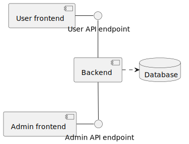
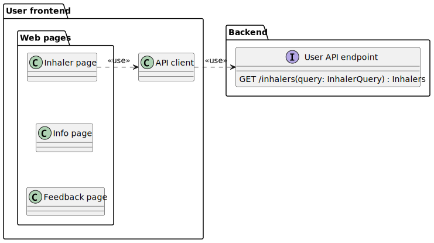
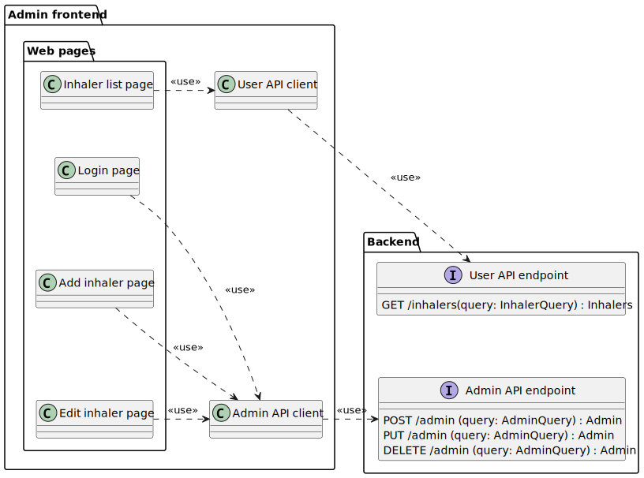
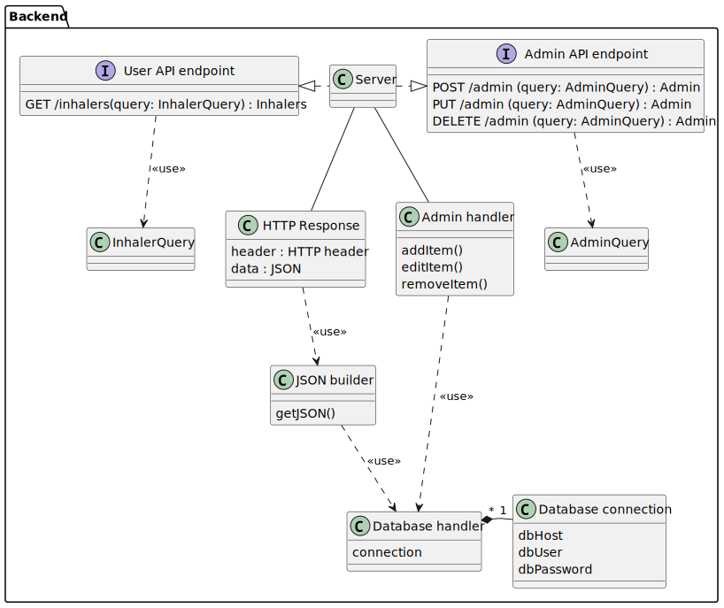
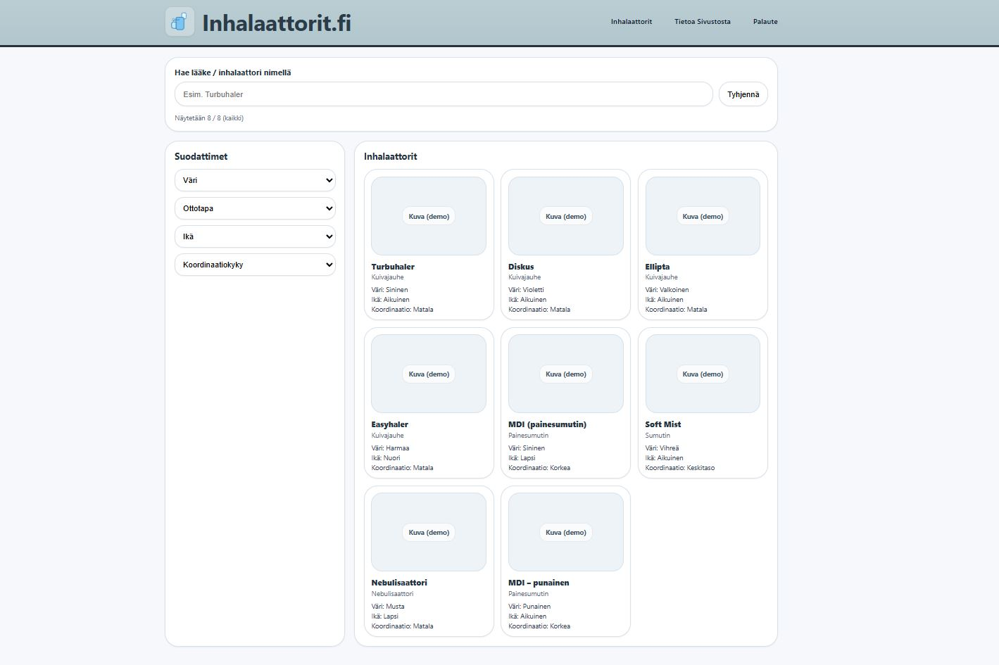

# Inhalaattorit.fi Design Document

## Introduction

The purpose of this document is to describe the design of Inhalaattorit.fi website and to provide design specifications that guide development and ensure maintainability. The document is divided into six chapters:

- **System architecture:** Overall system structure of the website, major component descriptions, and explanations of design patterns.
- **Data design:** Details on database structure, and data models and processing.
- **Interface design:** Internal communication between frontend and backend.
- **Component design:**  System components, their internal structure, responsibilities, and interactions.
- **User interface design:** Website layout, navigation, and functionality.
- **Dependencies:** External dependencies, such as libraries, used in the implementation.

The website provides information for doctors, nurses, and pharmacists on the correct use of inhalators available in Finland. Its goal is to reduce incorrect usage by offering a simple, easy-to-use interface where users can search for an inhalator and receive instructions. The website will not guide on inhalator prescription. While intended for healthcare professionals, the website will be publicly accessible.

Key requirements for the website:

- Ease of use.
- Low cost.
- Images of inhalators for visual identification.
- Link to Duodecim Terveysportti.
- Easy maintainability for adding and removing inhalators.
- Comprehensive documentation of code and interfaces.
- Feedback form for user input.
- Usage analytics.

## System architecture

### Overview

### Frontend architecture

- User frontend
- Admin frontend
- HTML
- CSS
- JS
- React Material UI?

### Backend architecture

- API endpoints
  - User API
  - Admin API
- Services
- SQL Database

User:
GET /inhalers

Admin:
POST /admin/inhalers
PUT   /admin/inhalers/{id}
DELETE /admin/inhalers/{id}

### External services

- Google analytics?
- Google forms?

## Data design

Database must be designed so that new categories can be added in the future.

### Database design

(TODO: Database diagram here)

\* Signifies multiple options

- Lääke
  - nimi
  - id?
  - image_url?
  - kuvaus?
- Lääkemuoto *
  - jauhe
  - jauhekapseli
  - suihke
  - suihke sisäänhengityksen laukaisema
  - tilanjatkeella
- Ikä
  - Virallinen ikäraja (yli X vuosi) (lisätietona lapsiin)
  - lapset < 7v
  - Lapset 7-12v
  - Lapset >12v
  - Aikuinen > 18v
- Annostelu
  - Kerran päivässä
  - Kaksi kertaa päivässä
  - 1x/pv ylläpidossa astma
- Sisäänhengitysnopeus ja koordinaatio
  - Sisäänhengitysnopeus hyvä (> 30l/min), hyvä koordinaatio
  - Sisäänhengitysnopeus huono (< 30l/min), hyvä koordinaatio
  - Sisäänhengitysnopeus hyvä (> 30l/min), huono koordinaatio
  - Sisäänhengitysnopeus huono (< 30 l/min), Huono koordinaatio
- Inhalaattori *
  - Ellipta
  - DIskus
  - Trubuhaler
  - Easyhaler
  - Nexthaler
  - Twisthaler
  - Breezhaler
  - Respimat
  - Evohaler
  - Autohaler
  - Genuair
  - Aerosphere
- Lääkken käyttötarkoitus
  - Hoitava lääke
  - Oirelääke
- Lääkeaineryhmä *
  - ICS (hengitettävä kortisoni, inhaled corticosteroids)
  - LAMA (pitkävaikutteinen antikolinergi, long acting muscarinic antagonist)
  - LABA (pitkävaikutteinen β2-agonisti, long acting β2-agonist)
  - SABA (lyhytvaikutteinen β2-agonisti, short acting β2-agonist)
  - SAMA (lyhytvaikutteinen antikolinergi, short acting muscarinic antagonist)
- Vaikuttava lääkeaine *
  - Beklometasoni ICS
  - Budesonidi ICS
  - Flutikasonipropionaatti ICS
  - Flutikasonifuroaatti ICS
  - Mometasoni ICS
  - Siklesonidi ICS
  - Formoteroli LABA
  - Salmeteroli LABA
  - Vilanteroli LABA
  - Indakateroli LABA
  - Olodateroli LABA
  - Tiotropiumbromidi LAMA
  - Aklidiniumbromidi LAMA
  - Glykopyrroniumbromidi LAMA
  - Umeklinidiumbromidi LAMA
  - Salbutamoli SABA
  - Terbutaliini SABA
- Väri
  - Valkoinen
  - Pinkki
  - Punainen
  - Keltainen
  - Oranssi
  - Violetti
  - Sininen
  - Harmaa
  - Ruskea
  - Vihreä

## Interface design

(TODO: API design, GET JSON format?)

## Component design

### Frontend components

#### User frontend

(TODO: User frontend component design)

#### Admin frontend

(TODO: Admin frontend component design)

### Backend components

(TODO: Backend component design)

## User interface design

### Website

(TODO: Add prototypes)

### Admin portal

(TODO: Add prototypes)

## Dependencies

- Node.js
- React?
- Material-UI?